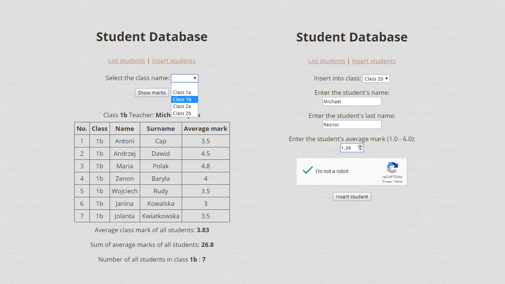

# Learning PHP - Exam exercise

> Training course - Pasja Informatyki, Web Development course, episode 6 ( [Link](https://www.youtube.com/watch?v=5LGojZZct5g) )

## General info

Learning PHP. Exam exercise. Connecting to a simulated school database, entering the class name and showing the list of students with all average marks. Then calculating the average marks of all class and showing it on screen. Also shows the average mark total for a class and total students in each class.

## Technologies

* HTML5
* CSS
* PHP
* MySQL
* xampp
* phpmyAdmin
* Notepad++
* Microsoft Visual Studio Code

## Screenshot

## Contact

[ReznoRMichael](https://github.com/ReznoRMichael)